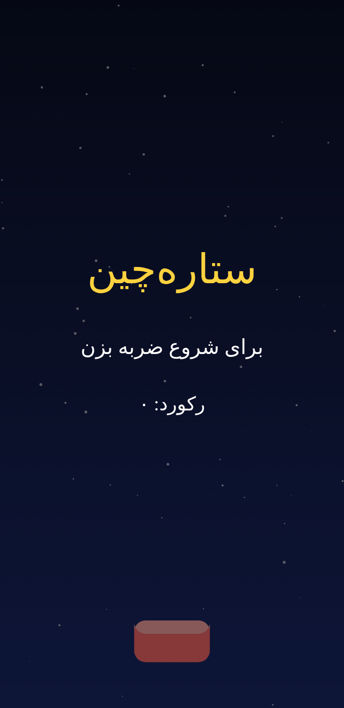
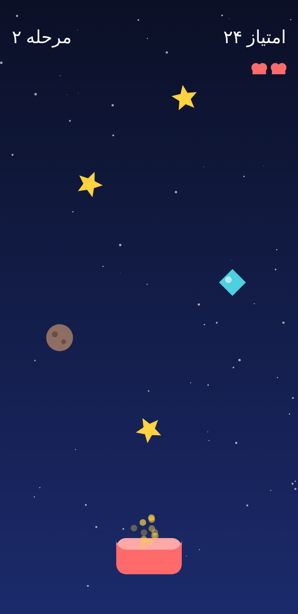
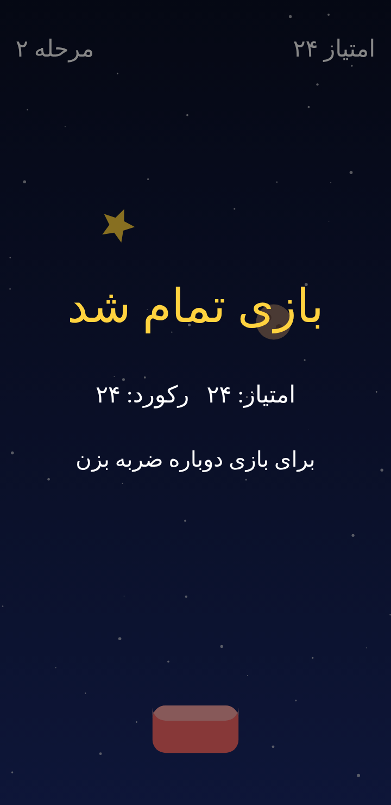

# Star Catcher — «ستاره‌چین» 🌟

A friendly arcade catch-and-dodge game for Android, made for kids **ages 7–13**.
The in-game language is **Persian (Farsi), fully right-to-left**, including
Persian digits.

Slide the basket along the bottom of the screen with one finger. **Catch the
falling stars and gems** to score, and **dodge the asteroids**. The longer you
last, the faster things fall — easy to pick up for younger players, fast enough
to challenge older ones.

## Screenshots

| Start | Gameplay | Game over |
| --- | --- | --- |
|  |  |  |

> These are faithful design renders of the game's drawing code (the project
> can't compile an APK in this environment, which has no Android SDK). They
> mirror the exact colors, geometry, and Persian/RTL text the app draws.

See **[ROADMAP.md](ROADMAP.md)** for the Agile, sprint-based development plan.

## Why this genre

For a 7–13 audience a single game has to work for very different players. An
arcade catch-and-dodge game fits because it is:

- **Instantly learnable** — one-finger drag, no reading or tutorial needed.
- **Self-scaling in difficulty** — speed and spawn rate ramp with your score, so
  the same game stays gentle for a 7-year-old and tense for a 13-year-old.
- **Short and replayable** — quick rounds with an immediate "tap to play again".
- **Family-safe** — no violence, no text, no ads, no network access.

## Gameplay

| Item | Effect |
| --- | --- |
| ⭐ Star | +1 point |
| 💎 Gem | +5 points (falls faster) |
| ☄️ Asteroid | Costs a life if caught — dodge it! |

You have 3 lives. Missing a star is harmless; only catching an asteroid hurts.
Your best score is saved on the device.

## Tech

- 100% Kotlin, no game engine — a custom `SurfaceView` game loop.
- Only AndroidX `core-ktx` and `appcompat` as dependencies.
- `minSdk 21` (Android 5.0) → `targetSdk 34`.
- All art is drawn at runtime / vector drawables, so there are no binary assets.

### Project layout

```
app/src/main/java/com/kidsgames/starcatcher/
  MainActivity.kt   # Activity host, keeps the screen on
  GameView.kt       # Game loop, state machine, input, HUD, difficulty scaling
  Entities.kt       # Basket, falling items, particles + their drawing
```

## Building

Open in Android Studio, or from the command line with the Android SDK installed:

```bash
./gradlew assembleDebug
# APK at app/build/outputs/apk/debug/app-debug.apk
```

> Note: building requires the Android SDK (`ANDROID_HOME` / `local.properties`).
